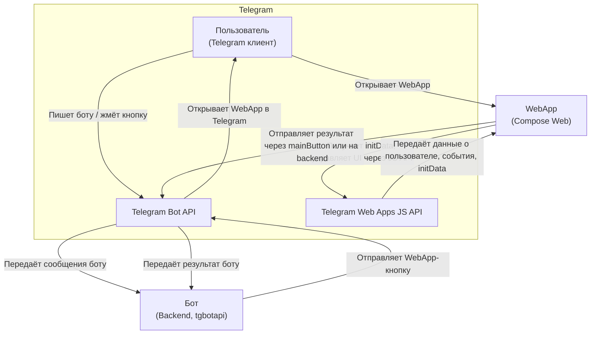

# telegram-fullstack-kotlin

**Сейчас:**
- Базовая структура fullstack-проекта на Kotlin Multiplatform (бот, web, common).
- Собирается, но бот-заготовка закомментирована (ожидает доработки архитектуры и зависимостей).
- Вся бизнес-логика и модели — в общем модуле (DDD, Arrow, Railway Oriented Programming).

**Дальше:**
- Реализовать рабочий backend-бот на tgbotapi (JVM).
- Подключить полноценный WebView-интерфейс (Compose Web + Telegram Web Apps API).
- Покрыть критические сценарии e2e-тестами.

## Архитектура
- **Kotlin Multiplatform**: backend (JVM), frontend (Compose Web), общий модуль (commonMain)
- **Backend**: tgbotapi, DDD, Railway Oriented Programming, Arrow, Ktor
- **Frontend**: Compose Multiplatform Web, интеграция с Telegram Web Apps JS API
- **Тесты**: unit, e2e

## Структура
```
backend/
  bot/         # Бот (JVM, tgbotapi)
  common/      # Общие модели, бизнес-логика (KMP)
frontend/
  web/         # WebView-интерфейс (Compose Web)
```

---

## Используемые библиотеки и технологии
- [dev.inmo:tgbotapi](https://github.com/InsanusMokrassar/TelegramBotAPI) — работа с Telegram Bot API на Kotlin
- [Arrow](https://arrow-kt.io/) — функциональные типы (Either, Validated, Result)
- [Ktor](https://ktor.io/) — web-сервер для backend
- [Compose Multiplatform Web](https://github.com/JetBrains/compose-multiplatform) — UI для web (если используется)

---

## Взаимодействие: Бот и Telegram WebApp

В проекте используются две ключевые части:
- **Бот** (backend, tgbotapi) — серверное приложение, общающееся с Telegram через Bot API.
- **WebApp** (frontend, Compose Web) — веб-приложение, открывающееся внутри Telegram-клиента по кнопке.

### Зачем WebApp интеграция с Telegram?
- **WebApp** запускается внутри Telegram и получает от Telegram специальный контекст (`initData`), который содержит информацию о пользователе, чате и подпись Telegram (для безопасности).
- Через [Telegram Web Apps JS API](https://core.telegram.org/bots/webapps) WebApp может:
  - Узнать, кто его открыл (user id, имя, язык и т.д.)
  - Управлять Telegram UI (mainButton, alerts, темы)
  - Безопасно отправлять данные обратно боту или на backend
- Без этой интеграции WebApp не сможет работать как Telegram Mini App: не узнает пользователя, не сможет отправить результат, не будет защищён от подделки.

### Типовой сценарий работы
1. Пользователь пишет боту → Бот отправляет кнопку "Открыть WebApp".
2. Пользователь кликает → В Telegram открывается WebView с вашим фронтендом.
3. WebApp получает `initData` через JS API Telegram.
4. WebApp может отправлять данные обратно боту (через mainButton или backend).
5. Бот получает результат и продолжает диалог.

### Схема взаимодействия



---

## Запуск

### Backend (бот)
```
cd backend/bot
./gradlew run
```

### Frontend (WebView)
```
cd frontend/web
./gradlew jsBrowserRun
```

## Тесты

### Unit-тесты
```
./gradlew test
```

### e2e-тесты
(см. инструкции в соответствующих модулях)

---

- DDD, функциональный стиль, Railway Oriented Programming
- Ошибки — только через sealed class/Result/Either (arrow-kt)
- e2e — must have, покрытие >80%
- Чистый, идиоматичный Kotlin
- Вся инфраструктура — через порты/интерфейсы
- Линтинг, тесты, покрытие — строго обязательно
